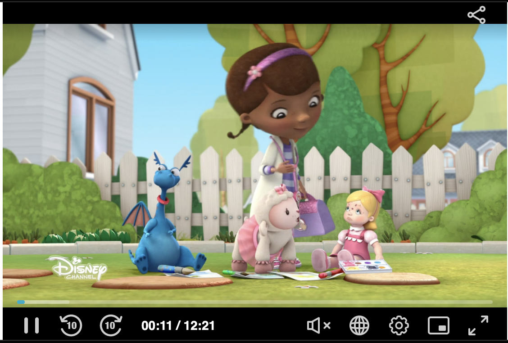

# PlayKit JS Share - [Share] UI Plugin for the [Kaltura Player JS]

[](https://travis-ci.org/kaltura/playkit-js-share)
[](https://github.com/prettier/prettier)
[](https://www.npmjs.com/package/@playkit-js/share)
[](https://www.npmjs.com/package/@playkit-js/share/v/canary)

PlayKit JS Share is written in [ECMAScript6], statically analysed using [Flow] and transpiled in ECMAScript5 using [Babel].

[flow]: https://flow.org/
[ecmascript6]: https://github.com/ericdouglas/ES6-Learning#articles--tutorials
[babel]: https://babeljs.io
[kaltura player js]: https://github.com/kaltura/kaltura-player-js

## Getting Started

### Prerequisites

The plugin requires [Kaltura Player JS] to be loaded first.

### Installing

First, clone and run [yarn] to install dependencies:

[yarn]: https://yarnpkg.com/lang/en/

```
git clone https://github.com/kaltura/playkit-js-share.git
cd playkit-js-share
yarn install
```

### Building

Then, build the player

```javascript
yarn run build
```

### Embed the library in your test page

Finally, add the bundle as a script tag in your page, and initialize the player

```html
<script type="text/javascript" src="/PATH/TO/FILE/kaltura-{ovp/ott}-player.js"></script>
<script type="text/javascript" src="/PATH/TO/FILE/playkit-js-share.js"></script>
<div id="player-placeholder"" style="height:360px; width:640px">
<script type="text/javascript">
  var config = {
    targetId: 'player-placeholder',
    provider: {
      partnerId: {YOUR_PARTNER_ID}
      ...
    },
    ...
    plugins: {
      'share': {
        'shareUrl': 'YOUR SHARE URL', //string - Default will take the parent url
        'embedUrl': 'YOUR EMBED URL', //string
        'enableTimeOffset': true, //boolean - Default false
        'useNative': true, //boolean - use native API
        'uiComponent': {
          'presets': ['Playback', 'Live'],
          'area': 'TopBarRightControls'
        }
      }
    }
  ...
  };
  var player = KalturaPlayer.setup(config);
  player.play();
</script>
```
</br>
</br>

## Documentation

Share plugin enables to share the current content or some other content related url to the social media.

Share plugin also enables customizing the sharing attributes. 

If share plugin is enabled  share icon will be added to the player's top right corner configurable using the uiComponent [area](https://github.com/kaltura/playkit-js-ui/blob/master/docs/ui-components.md#general) attribute.

```
"uiComponent": {
          "label": 'shareButtonComponent',
          "presets": ['Playback', 'Live'],
          "area": 'TopBarRightControls'
},
```


#### Sharing Capabilities

* Share to a social networks
* Email a link to the video
* Copy a code which enables the video to be embedded

#### UI Examples




#### Configuration attributes:
#### shareUrl

* The shareUrl to use if we want to force such and not using the default share url (using this option will override the definition you have given in `shareOptions`)

#### embedUrl

* The suggested embedUrl to use if default one is not what app requires

#### enableTimeOffset
* Whether to add also start postion to the shared media

#### useNative
* If the share icon is clicked users will have the ability to choose how to share the desired content using plauer custom UI or the native share api

#### shareOptions
`shareOptions` are optional, the plugin can work only with shareUrl or embedUrl stand alone
once it is added the plugin use uts configured attributes and will disply only the named plugins in the list and in the same order it was added means FB will be displayed before Linkedin for the below example. 

**[Configuration](./docs/configuration.md)**

#### Config Example

```
"plugins": {
      "share": {
        //"shareUrl": "www.cnn.com",
        //"embedUrl": "{embedBaseUrl}/p/{partnerId}/embedPlaykitJs/uiconf_id/{uiConfId}?iframeembed=true&entry_id={entryId}",
        "enableTimeOffset": true,
        "useNative": false,
        "uiComponent": {
          "label": 'shareButtonComponent',
          "presets": ['Playback', 'Live'],
          "area": 'TopBarRightControls'
        },
        
        "shareOptions": {
          "facebook": {
            "display": true,
            "templateUrl": "https://www.facebook.com/sharer/sharer.php?u={shareUrl}",
            "title": "share.share-on-facebook",
            "icon": "M8 9.63017H9.5003V8.22342C9.5003 7.60278 9.51651 6.64628 9.98306 6.05362C10.4752 5.42639 11.1499 5 12.3116 5C14.2034 5 15 5.26011 15 5.26011L14.6256 7.4044C14.6256 7.4044 14.0004 7.23072 13.417 7.23072C12.8336 7.23072 12.3116 7.43238 12.3116 7.99459V9.63017H14.7032L14.536 11.7242H12.3116V19H9.5003V11.7242H8V9.63017Z"
          },
          "linkedin": {
            "display": true,
            "templateUrl": "https://www.linkedin.com/shareArticle?mini=true&url={shareUrl}",
            "title": "share.share-on-linkedin",
            "icon": "M18 19H15.1268V14.43C15.1268 13.2338 14.6774 12.4172 13.6891 12.4172C12.9331 12.4172 12.5128 12.9682 12.3171 13.4993C12.2437 13.69 12.2552 13.9555 12.2552 14.221V19H9.40875C9.40875 19 9.44544 10.9047 9.40875 10.1688H12.2552V11.5548C12.4233 10.9488 13.3329 10.0839 14.7844 10.0839C16.5852 10.0839 18 11.3542 18 14.0895V19ZM6.53022 9.06416H6.51188C5.59466 9.06416 5 8.38906 5 7.53333C5 6.66095 5.61224 6 6.5478 6C7.4826 6 8.05738 6.65928 8.07573 7.53083C8.07573 8.38657 7.4826 9.06416 6.53022 9.06416ZM5.3279 19H7.86171V10.1688H5.3279V19Z"
          },
          "twitter": {
            "display": true,
            "templateUrl": "https://twitter.com/share?url={shareUrl}",
            "title": "share.share-on-twitter",
            "icon": "M17.3508 8.73918C17.9441 8.39596 18.3993 7.85172 18.6138 7.20339C18.0583 7.5212 17.4444 7.7524 16.7887 7.87635C16.2661 7.33687 15.5191 7 14.6924 7C13.1073 7 11.8213 8.24341 11.8213 9.77681C11.8213 9.99451 11.8459 10.2059 11.8952 10.4092C9.50807 10.2932 7.39209 9.18888 5.97458 7.5069C5.72724 7.91845 5.5859 8.39596 5.5859 8.90444C5.5859 9.86739 6.09292 10.7175 6.86371 11.2157C6.39367 11.2022 5.94993 11.0758 5.56207 10.8693V10.9034C5.56207 12.2493 6.55227 13.372 7.86705 13.6262C7.62628 13.6914 7.37237 13.7239 7.11023 13.7239C6.92534 13.7239 6.74456 13.7073 6.56953 13.6747C6.9352 14.7775 7.99525 15.5807 9.25251 15.6022C8.26971 16.3474 7.03052 16.7915 5.68533 16.7915C5.4536 16.7915 5.22434 16.7788 5 16.7534C6.27123 17.54 7.78159 18 9.40289 18C14.6867 18 17.5751 13.7692 17.5751 10.0994C17.5751 9.97862 17.5726 9.85785 17.5677 9.73947C18.129 9.34778 18.6162 8.85915 19 8.3022C18.4856 8.52308 17.9317 8.67244 17.3508 8.73918Z"
          },
          "email": {
            "display": true,
            "templateUrl": "mailto:?subject=Check out {description}&body=Check out {description} - {shareUrl}",
            "title": "share.email",
            "icon": {
              "fill-rule": "evenodd",
              "clip-rule": "evenodd",
              "d": "M21 6.75C21 5.7835 20.1941 5 19.2 5H4.8C3.80589 5 3 5.7835 3 6.75V17.25C3 18.2165 3.80589 19 4.8 19H19.2C20.1941 19 21 18.2165 21 17.25V6.75ZM18.8944 8.55276C18.6474 8.05878 18.0467 7.85856 17.5528 8.10555L12 10.881L6.44719 8.10555L6.33987 8.05941C5.8692 7.88866 5.33489 8.09407 5.10555 8.55276C4.85856 9.04674 5.05878 9.64741 5.55276 9.8944L11.5528 12.8944L11.6762 12.9461C11.9279 13.0323 12.2059 13.0151 12.4472 12.8944L18.4472 9.8944L18.5485 9.83623C18.9675 9.56215 19.1237 9.01146 18.8944 8.55276Z"
            }
          },
          "embed": {
            "display": true,
            "templateUrl": "<iframe src=\"{embedUrl}\" style=\"width: 560px;height: 395px\" allowfullscreen webkitallowfullscreen mozAllowFullScreen frameborder=\"0\" allow=\"accelerometer *; autoplay *; encrypted-media *; gyroscope *; picture-in-picture *\"/>",
            "title": "share.embed",
            "icon": "M13.9864 6.16443C14.0772 5.61966 13.7092 5.10444 13.1644 5.01364C12.6197 4.92285 12.1044 5.29086 12.0136 5.83564L10.0136 17.8356C9.92284 18.3804 10.2909 18.8956 10.8356 18.9864C11.3804 19.0772 11.8956 18.7092 11.9864 18.1644L13.9864 6.16443Z M15.2929 15.7071C14.9024 15.3166 14.9024 14.6834 15.2929 14.2929L17.5858 12L15.2929 9.70711C14.9024 9.31658 14.9024 8.68342 15.2929 8.29289C15.6834 7.90237 16.3166 7.90237 16.7071 8.29289L19.7071 11.2929C20.0976 11.6834 20.0976 12.3166 19.7071 12.7071L16.7071 15.7071C16.3166 16.0976 15.6834 16.0976 15.2929 15.7071Z M8.70711 8.29289C9.09763 8.68342 9.09763 9.31658 8.70711 9.70711L6.41421 12L8.70711 14.2929C9.09763 14.6834 9.09763 15.3166 8.70711 15.7071C8.31658 16.0976 7.68342 16.0976 7.29289 15.7071L4.29289 12.7071C3.90237 12.3166 3.90237 11.6834 4.29289 11.2929L7.29289 8.29289C7.68342 7.90237 8.31658 7.90237 8.70711 8.29289Z"
          }
   }
}
```


#### Example

**[Share Plugin Example](https://codepen.io/giladna/pen/KKoOrLV)**

</br>

## Running the tests

Tests can be run locally via [Karma], which will run on Chrome, Firefox and Safari

[karma]: https://karma-runner.github.io/1.0/index.html

```
yarn run test
```

You can test individual browsers:

```
yarn run test:chrome
yarn run test:firefox
yarn run test:safari
```

### And coding style tests

We use ESLint [recommended set](http://eslint.org/docs/rules/) with some additions for enforcing [Flow] types and other rules.

See [ESLint config](.eslintrc.json) for full configuration.

We also use [.editorconfig](.editorconfig) to maintain consistent coding styles and settings, please make sure you comply with the styling.

## Contributing

Please read [CONTRIBUTING.md](https://gist.github.com/PurpleBooth/b24679402957c63ec426) for details on our code of conduct, and the process for submitting pull requests to us.

## Versioning

We use [SemVer](http://semver.org/) for versioning. For the versions available, see the [tags on this repository](https://github.com/kaltura/playkit-js-share/tags).

## License

This project is licensed under the AGPL-3.0 License - see the [LICENSE.md](LICENSE.md) file for details
